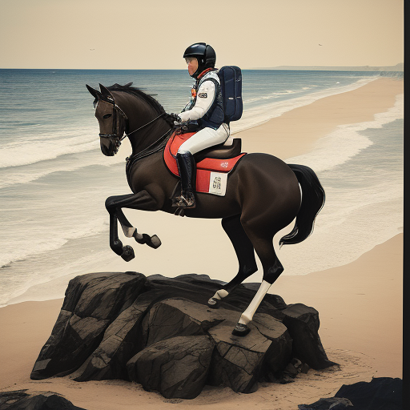
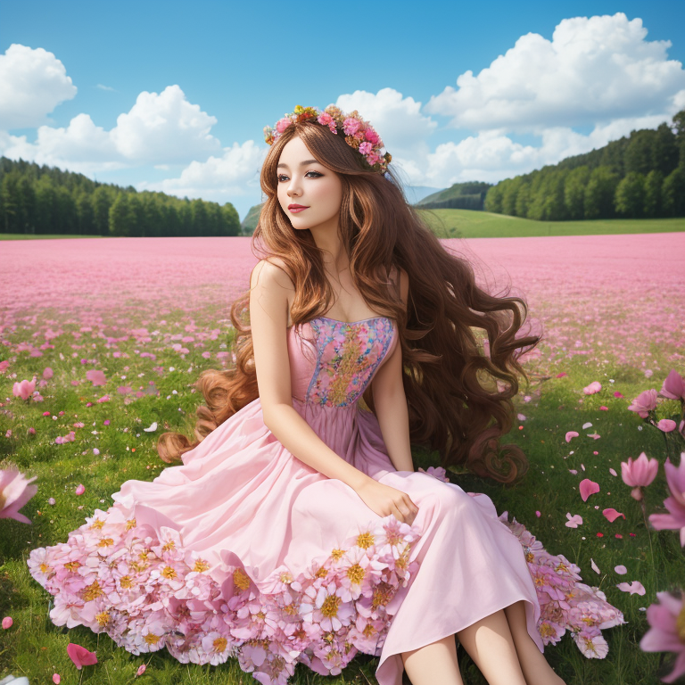

# FABRIC Plugin for Stable Diffusion WebUI

Official FABRIC implementation for [automatic1111/stable-diffusion-webui](https://github.com/AUTOMATIC1111/stable-diffusion-webui). Steer the model towards generating desirable results by simply liking/disliking images. These feedback images can be generated or provided by you and will make the model generate images that look more/less like the feedback. Instead of meticulously iterating on your prompt until you get what you're looking for, with FABRIC you can simply "show" the model what you want and don't want.

📜 Paper: https://arxiv.org/abs/2307.10159

🎨 Project page: https://sd-fabric.github.io

ComfyUI node (by [@ssitu](https://github.com/ssitu)): https://github.com/ssitu/ComfyUI_fabric


## Releases

- [29.08.2023] 🏎️ v0.6.0: Up to 2x faster and 4x less VRAM usage thanks to [Token Merging](https://github.com/dbolya/tomesd/tree/main) (tested with 16 feedback images and a batch size of 4), moderate gains for fewer feedback images (10% speedup for 2 images, 30% for 8 images). Enable the Token Merging option to take advantage of this.
- [22.08.2023] 🗃️ v0.5.0: Adds support for presets. Makes generated images using FABRIC more reproducible by loading the correct (previously used) feedback images when using "send to text2img/img2img".

## Installation

1. Open the "Extensions" tab
2. Open the "Install from URL" tab
3. Copy-paste `https://github.com/dvruette/sd-webui-fabric.git` into "URL for extension's git repository" and press "Install"
4. Switch to the "Installed" tab and press "Apply and restart UI"
5. (optional) Since FABRIC is quite VRAM intensive, using `--xformers` is recommended.
   1. If you still run out of VRAM, try enabling the "Token Merging" setting for even better memory efficiency.

### Compatibility Notes
- SDXL is currently not supported (PRs welcome!)
- Compatibility with other plugins is largely untested. If you experience errors with other plugins enabled, please disable all other plugins for the best chance for FABRIC to work. If you can figure out which plugin is incompatible, please open an issue.
- The plugin is INCOMPATIBLE with `reference` mode in the ControlNet plugin. Instead of using a reference image, simply add it as a liked image. If you accidentally enable FABRIC and `reference` mode at the same time, you will have to restart the WebUI to fix it.
- Some attention processors are not supported. In particular, `--opt-sub-quad-attention` and `--opt-split-attention-v1` are not supported at the moment.


## How-to and Examples

### Basic Usage
0. Enable the FABRIC extension
1. Add feedback images:
      - select an image from a previous generation and press 👍/👎 in the "Current batch" tab OR
      - select the "Upload image" tab, upload an image of your preference and press 👍/👎
2. Press "Generate" to generate a batch of images incorporating the selected feedback
3. Repeat: Add more feedback, optionally adjust your prompt and regenerate

_Tips:_
- You don't have to keep using the same prompt that you used to generate feedback images. In fact, adjusting the prompt in conjunction with providing feedback is most powerful.
- While the number of feedback images is only limited by the size of your GPU, using fewer feedback images tends to give better results that clearly reflect both the prompt and feedback. Increasing the number of feedback images can sometimes lead to the model getting confused, giving too much weight to certain feedback images or completely ignoring others.

#### Feedback Strength

The feedback strength controls how much the model pays attention to your feedback images. The higher, the more it will try to stay close to the feedback, potentially ignoring certain aspects of the prompt. Lowering this value is recommended if you're using large numbers of feedback images or if you feel like the model sticks too close to the feedback.

#### Feedback Schedule

Using `feedback start` and `feedback end` it's possible to control at which denoising steps the model tries to incorporate the feedback. As a rule of thumb, early steps will influence high-level, coarse features (overall composition, large objects in the scene, ...) and later steps will influence fine-grained, low-level features (details, texture, small objects, ...). Adjusting these values makes it possible to only use feedback on certain features in the generation. A value of `0.0` corresponds to the first and `1.0` to the last denoising step (linear interpolation in between).

Generally, it's recommended to have feedback active from the start but not until the end, but violating these principles can give interesting results in their own right, especially when simultaneously adjusting feedback strength.

#### Token Merging

Token merging (ToMe) is an optimization technique that improves speed and memory usage at the cost of accuracy. Enabling this _will_ change your results, but it can make generation times significantly faster (I observed up to 50%), especially for large resolutions and large numbers of feedback images.


### Examples

#### Style Control using Feedback
Generating images in a certain style, adding them as feedback and dropping the style from the prompt allows retaining certain aspects from the style while retaining flexibility in the prompt:

| Feedback image | Without feedback | With feedback |
| --- | --- | --- |
|  |  |  |
| picture of a horse riding on top of an astronaut, ukiyo-e | picture of a horse riding on top of an astronaut on the beach | picture of a horse riding on top of an astronaut on the beach |

Negative prompt: `lowres, bad anatomy, bad hands, cropped, worst quality`; Seed: `1531668169`

#### Feedback Strength
Feedback strength controls how much the model pays attention to the feedback. This example demonstrates the effect of varying it:

| Feedback image | | | |
| --- | --- | --- | --- |
|  | | | |
| weight=0.0 | weight=0.2 | weight=0.4 | weight=0.8 |
|  |  |  |  |

Prompt: `[macro picture of a pineapple, zoomcore:photo of new york at sunrise:0.3], masterpiece, trending on artstation[:, extremely detailed, hyperrealistic, 8k:0.5]`; Negative prompt: `lowres, bad anatomy, bad hands, cropped, worst quality, grayscale`; Seed: `2345285976`;


#### Feedback Schedule
By adjusting the feedback schedule, it's possible to control which features are influenced by the feedback. In this example, the feedback is only active between 30% and 60% of the generation, which allows to isolate the effect of the feedback:

| Feedback image | Without feedback | Default schedule (0.0 - 0.8) | Custom schedule (0.3 - 0.6) |
| --- | --- | --- | --- |
|  |  |  |  |

Prompt: `a woman with long flowy hair wearing a (dress made of pink flowers:1.1) sitting on a sunny meadow, vibrant`; Negative prompt: `lowres, bad anatomy, bad hands, cropped, worst quality, grayscale, muted colors, monochrome, sepia`; Seed: `2844331335`


_All examples were created using the DreamShaper 7 model: https://huggingface.co/Lykon/DreamShaper/tree/main_

<details>
   <summary><h3>Advanced Usage</h3></summary>

   #### Min. strength
   Adjusting the minimum feedback strength controls how much feedback is incorporated during the passive phase, outside of the feedback schedule (i.e. when FABRIC is "inactive", before `feedback start` and after `feedback end`). This allows emphasizing the feedback during certain phases (feature scales) of the generation but still incorporating at least some of it from beginning to end. By default this is 0, so feedback is only incorporated during the active phase.
   
   #### Negative weight
   The negative weight controls how much negative feedback is incorporated relative the the positive feedback. We have found that it's generally preferrable to have lower feedback strenth for negative images, which is why by default this value is `0.5`. Increasing this increases the influence of negative feedback (without changin the influence of positive feedback).
   
   #### ToMe settings
   These settings are quite technical and understanding them is not strictly necessary for using them. Merge ratio controls the ratio of tokens that get merged: higher merge ratio -> fewer tokens -> more speed and less memory, but lower quality. Max. tokens limits the number of feedback tokens: fewer tokens -> more speed, less memory, but lower quality. The seed controls which tokens have a chance of being merged and is mainly there for reproducibility purposes. Changing the seed can alter the outcome quite significantly depending on how aggressive the other ToMe settings are.
   
   More information on ToMe: https://github.com/dbolya/tomesd/tree/main
</details>


## Citation
```
@misc{vonrutte2023fabric,
      title={FABRIC: Personalizing Diffusion Models with Iterative Feedback}, 
      author={Dimitri von Rütte and Elisabetta Fedele and Jonathan Thomm and Lukas Wolf},
      year={2023},
      eprint={2307.10159},
      archivePrefix={arXiv},
      primaryClass={cs.CV}
}
```
