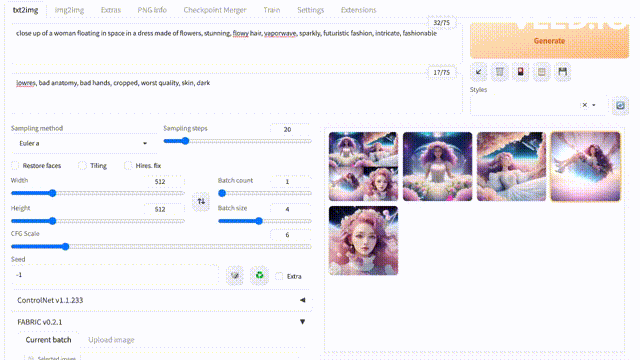

# FABRIC Plugin for Stable Diffusion WebUI

Alpha version of a plugin for [automatic1111/stable-diffusion-webui](https://github.com/AUTOMATIC1111/stable-diffusion-webui). Expect bugs and rough edges and feel free to contribute if you know how fix them.

📜 Paper: https://arxiv.org/abs/2307.10159

🎨 Project page: https://sd-fabric.github.io



## Installation

1. Open the "Extensions" tab
2. Open the "Install from URL" tab
3. Copy-paste `https://github.com/dvruette/sd-webui-fabric.git` into "URL for extension's git repository" and press "Install"
5. Switch to the "Installed" tab and press "Apply and restart UI"

### Compatibility Notes
- Compatibility to other plugins is largely untested. If you experience errors with other plugins enabled, please disable all other plugins for the best chance of FABRIC working. If you can figure out which plugin is incompatible, please open an issue.
- The plugin is INCOMPATIBLE with `reference` mode in the ControlNet plugin. Instead of using a reference image, simply add it as a liked image. If you accidentally enable FABRIC and `reference` mode at the same time, you will have to restart the WebUI to fix it.


## How-to and Examples

Coming soon. Feel free to share examples with us if you have found something that works well and we'll add it here :)


## Citation
```
@misc{vonrutte2023fabric,
      title={FABRIC: Personalizing Diffusion Models with Iterative Feedback}, 
      author={Dimitri von Rütte and Elisabetta Fedele and Jonathan Thomm and Lukas Wolf},
      year={2023},
      eprint={2307.10159},
      archivePrefix={arXiv},
      primaryClass={cs.CV}
}
```
